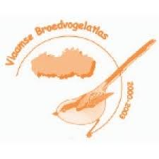
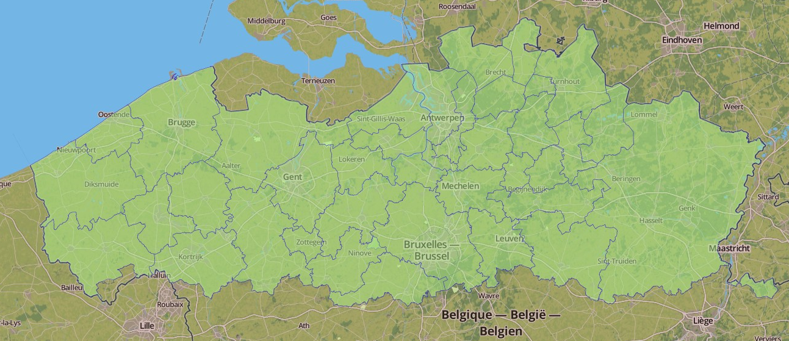

# Broedvogel - Atlas of breeding birds in Flanders, Belgium (2000-2002)

Dimitri Brosens[^1], Peter Desmet[^1]

[^1]: Research Institute for Nature and Forest (INBO), Kliniekstraat 25, 1070, Brussels, Belgium

**Corresponding author**: 

---

Received {date} | Revised {date} | Accepted {date} | Published {date}

---

**Citation**: Combination of authors, year of data paper publication (in parentheses), Title, Journal Name, Volume, Issue number (in parentheses), and doi of the data paper.

---

**Recource citation**: 

## Abstract

The first atlas of breeding birds in Flanders was published in 1988 and was based on fieldwork conducted between 1973-1977 (Devillers et al. 1988). For almost three decades, this work provided the only information available on the distribution and abundance of all breeding bird species in Flanders. Although several species-specific projects were subsequently undertaken, it was not until 1994 that a monitoring programme for rare, colonial and exotic bird species was initiated. This was co-ordinated by the INBO, a research institute of the Flemish Government. Although this project provided very useful information that could be used for defining special protection areas (SPAs), it was clear that the rest of the breeding avifauna, including common species, was experiencing major changes. As a direct response, during 1998, a new comprehensive breeding atlas project was launched by the INBO and initial contracts were drawn-up to kick-start the process.

During the 2000-2002 atlas period, a total of 183 species were recorded as breeding birds in Flanders, including 13 exotic species but excluding domesticated forms of Greylag Goose, Mallard and Stock Dove and two subspecies (Yellow Wagtail ssp. flavissima and White Wagtail ssp. yarrellii). 

## Keywords

birds, breeding birds, nature restoration, occurrence, observation, Lifewatch

## Data published through

<http://dataset.inbo.be/broedvogel-atlas-occurrences>

## Rationale

The first atlas of breeding birds in Flanders was published in 1988 and was based on fieldwork conducted between 1973-1977 (Devillers et al. 1988). For almost three decades, this work provided the only information available on the distribution and abundance of all breeding bird species in Flanders. Although several species-specific projects were subsequently undertaken, it was not until 1994 that a monitoring programme for rare, colonial and exotic bird species was initiated. This was co-ordinated by the INBO, a research institute of the Flemish Government. Although this project provided very useful information that could be used for defining special protection areas (SPAs), it was clear that the rest of the breeding avifauna, including common species, was experiencing major changes. As a direct response, during 1998, a new comprehensive breeding atlas project was launched by the INBO and initial contracts were drawn-up to kick-start the process.

## Taxonomic coverage

All species in this dataset are birds (Aves). The top 3 recordings are: *Turdus merula* ; *Columba palumbus* and *Troglodytes troglodytes* the least observed breeding birds in flanders are *Upupa epops* ; *Oxyura jamaicensis* and *Larus michahellis*

### Taxonomic ranks

**Class**: Aves
**Order**: `Accipitriformes` `Anseriformes` `Apodiformes` `Charadriiformes` `Ciconiiformes` `Columbiformes` `Coraciiformes` `Cuculiformes` `Falconiformes` `Galliformes` `Gruiformes` `Passeriformes` `Pelecaniformes` `Piciformes` `Podicipediformes` `Psittaciformes` `Strigiformes` `Suliformes` `Upupiformes`
**Family**: `Anatidae` `Sylviidae` `Fringillidae` `Muscicapidae` `Accipitridae` `Laridae` `Motacillidae` `Rallidae` `Scolopacidae` `Ardeidae` `Paridae` `Picidae` `Columbidae` `Corvidae` `Charadriidae` `Emberizidae` `Strigidae` `Turdidae` `Alaudidae` `Falconidae` `Hirundinidae` `Phasianidae` `Podicipedidae` `Laniidae` `Passeridae` `Recurvirostridae` `Regulidae` `Aegithalidae` `Alcedinidae` `Apodidae` `Caprimulgidae` `Certhiidae` `Ciconiidae` `Cisticolidae` `Cuculidae` `Haematopodidae` `Meropidae` `Oriolidae` `Phalacrocoracidae` `Prunellidae` `Psittacidae` `Remizidae` `Sittidae` `Sturnidae` `Threskiornithidae` `Troglodytidae` `Tytonidae` `Upupidae` 

## Geographic coverage

Flanders is one of the three administrative regions in the country of Belgium, located in the centre of Western Europe. The Flemish region is situated in the north of the country and covers an area of 13,522km² (44,29% of Belgium). The Belgian climate is maritime temperate, influenced by the North Sea and the Atlantic Ocean with significant precipitation in all seasons. The summer is moderate and the winters are mild. The two main geographical regions of Flanders are the coastal plain in the North-West and the Central plain, further inland. With 470 inhabitants/km², Flanders is one of the most densely populated areas of Europe. 

### Bounding box for covered area

## Temporal coverage

## Dataset

### Dataset description

* **Object name**: Darwin Core Archive Broedvogel - Atlas of breeding birds in Flanders, Belgium (2000-2002)
* **Character encoding**: UTF-8
* **Format name**: Darwin Core Archive format
* **Format version**: 1.0
* **Distribution**: <http://dataset.inbo.be/broedvogel-atlas-occurrences>
* **Publication date of data**: `yyyy-mm-dd of first publication`
* **Language**: English
* **Licenses of use**: <http://creativecommons.org/publicdomain/zero/1.0/> & `norms`
* **Metadata language**: English
* **Date of metadata creation**: `yyyy-mm-dd of first publication`
* **Hierarchy level**: Dataset

### Additional information

`IPT > Additional metadata > Additional information`

### Usage norms

Norms on how to use the data. Does not appear in the IPT metadata.

## Methodology

### Study extent description

Fieldwork was carried out during the breeding seasons of 2000, 2001 and 2002. In 2003, a few additional squares were surveyed in order to increase coverage. Many birdwatchers were involved, organized at a local level by regional co-ordinators and overseen by a national co-ordinator and professional INBO staff. The largest volunteer organization in Flanders, Natuurpunt, was primarily involved in organizing the volunteer structure. In general, fieldwork consisted of surveys on both 5km x 5km and 1km x 1km scales and a total of 645 squares had to be surveyed.

The main aims of the atlas were as follows:

* to assess the current distribution of all breeding bird species in Flanders;
* to assess their relative abundance where possible;
* to create detailed population estimates for around 65 % of all species;
* to gather exact location data for all rare, colonial and exotic breeding bird species throughout Flanders.

It was planned to complete the fieldwork within 3 breeding seasons.

### Sampling description

During the 1999 breeding season, an inventory of several atlas squares was produced as a test. The method used in that first season replicated the one used in the Dutch atlas project (Sovon 2002) and was also based on the Universal Transverse Mercator (UTM) projection to divide Flanders into an internationally recognized grid of 5km x 5km squares.

Fieldwork was organized in such a way that less-experienced ornithologists were able to take part in the project. It was carried out during the breeding seasons of 2000, 2001 and 2002. In 2003, a few additional squares were surveyed in order to increase coverage. Many birdwatchers were involved, organized at a local level by regional co-ordinators and overseen by a national co-ordinator and professional INBO staff. The largest volunteer organization in Flanders, Natuurpunt, was primarily involved in organizing the volunteer structure. In general, fieldwork consisted of surveys on both 5km x 5km and 1km x 1km scales and a total of 645 squares had to be surveyed.

For practical reasons, Flanders was de divided in 38 atlas regions (Figure 2). And in every region a responsible recorder was identified and about 1233 recorders were involved in the project.

In each 5km x 5km square, volunteers were initially asked to try and locate as many breeding bird species as possible and to assess numbers as well as locations of a selected sub-set of species. In doing so, they were free to choose the time and duration of their observations, although a few general guidelines were provided. Subsequently, as part of a standardized fieldwork procedure, they were required to make two one-hour long visits to sets of eight fixed 1km x 1km squares. Each volunteer was provided with a 1:10,000 scale map of each 5km x 5km square on which the 1km x 1km squares were also indicated and several forms were issued to record their data (chapter 2, figures 2-4). As with the Dutch method, the species list was constructed to include a classification of breeding status, i.e. possible, probable or confirmed breeding (according to international atlas codes, chapter 2 table 1). The aim of the hour-long counts was to construct relative abundance maps, and during each hour a 5 minute point count was performed in the middle of every square. These short duration point counts fine-tuned the maps of common species, which were often recorded during the hour count, irrespective of their relative abundance. During the hour counts, observers were asked to record all breeding bird species present and to provide counts of the number of breeding pairs/territories for a selection of species (*listed in chapter 2, table 2 in broedvogelatlas*).

### Quality control description

All data obtained from atlas fieldwork were collected on standard recording forms. These were sent to the regional co-ordinator who checked them thoroughly and contacted volunteers in case of any obvious anomalies. Following this first step, data were sent to the INBO where they were checked once more before being entered in an SQL-database. Forms were printed from the database which were returned to the individual volunteers. They were asked to check the lists one last time in order to ensure accuracy. After the final breeding season, the completed lists for each region were sent to the relevant co-ordinators asking them to provide extra information on the annual numbers of some colonial or rare breeding bird species per square. For some pioneer species like Sand Martin and Avocet or obvious species like Rook, we wanted to be able to estimate the numbers in each of the three atlas years.

Technology also presented a convenient way of double-checking data. By posting preliminary versions of species maps (distribution, numbers and relative abundance) on a frequently updated website, volunteers were able to easily provide many useful comments. The site also provided the opportunity to submit records from outside the census procedures, resulting in over 60,000 extra observations. These observations were also submitted to regional co-ordinators to enable them to assess credibility and accuracy. Afterwards, if the observations enhanced the information per square, they were incorporated, while they could be traced at all times

### Method step description

In general, fieldwork consisted of surveys on both 5km x 5km and 1km x 1km scales and a total of 645 squares had to be surveyed.

## Project data

### Project title

Atlas of Flemish Breeding Brirds 2000-2002

### Personnel

* **Principal investigators**: 
* **Resource contact, resource creator, point of contact**: Glenn Vermeersch, Anny Anselin,...
* **Metadata provider**: 
* **Content providers**: 
* **Processors**: Dimitri Brosens, Peter Desmet

### Funding

Flemish Government

## References

