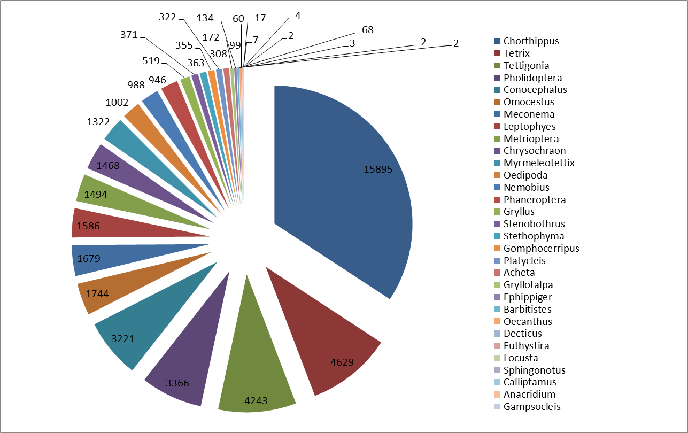
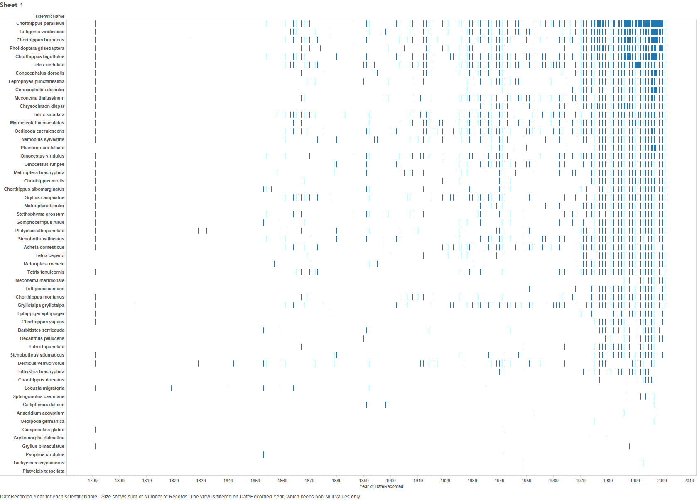
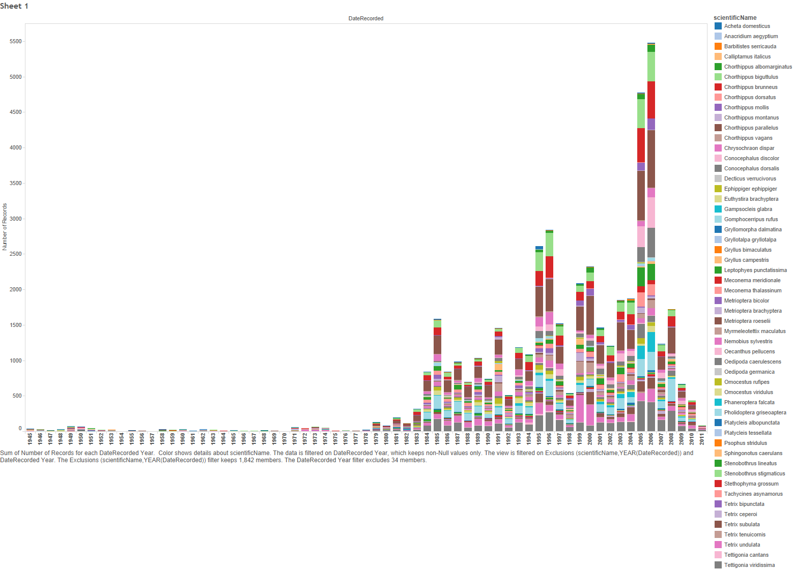
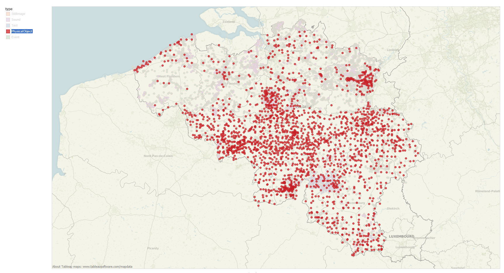
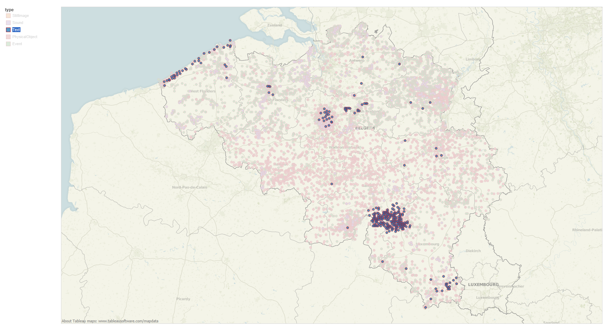

# Saltabel - Orthoptera in Belgium

Tim Adriaens[^1], Kris Decleer[^1], Hendrik Devriese[^2], Koen Lock[^2], Jorg Lambrechts[^4], Gilles San Martin y Gomez[^2] [^3], Frederic Piesschaert[^1], Dirk Maes[^1], Dimitri Brosens[^1], Peter Desmet[^1]

[^1]: Research Institute for Nature and Forest (INBO), Kliniekstraat 25, 1070, Brussels, Belgium

[^2]: Saltabel, Belgium

[^3]: Saltabru, Belgium

[^4]: Natuurpunt, Coxiestraat 11, 2800, Mechelen, Belgium

**Corresponding authors**: Tim Adriaens (<tim.adriaens@inbo.be>), Dimitri Brosens (<dimitri.brosens@inbo.be>)

---

**Resource citation**: Adriaens T, Decleer K, Devriese H, Lock K, Lambrechts J, San Martin y Gomez G, Piesschaert F, Maes D, Brosens D, Desmet P (2013): Saltabel - Orthoptera in Belgium. Research Institute for Nature and Forest (INBO). Dataset/Occurrence. <http://doi.org/10.15468/1rcpsq>

## Abstract

The Saltabel dataset deals with grasshopper and cricket occurrences in Belgium. The data are largely gathered by volunteer naturalists, who also reviewed and digitized data from existing museum and university collections in Belgium. Input in a database, feedback to observers, validation and database maintenance were cared for by a professional employee at the Institute for Nature Conservation (IN), now INBO (The Institute for Forest and Nature research). The Saltabel (Salta < Saltatoria; bel > Belgium) working group was established in 1989. The purpose of the Saltabel Database was mainly to collect information about the distribution, faunistics and ecology of grasshoppers and crickets in Belgium, The Netherlands and Luxembourg.  The working group produced a newsletter which appeared irregularly in the period 1989-2002 with the intention to inform observers about latest findings, interesting observations, ecological research etc., provide feedback to naturalists and to raise awareness about the conservation value of Orthoptera in general. During this period, the working group was most active and organized annual weekends, in turn organized in Belgium, the Netherlands and sometimes also northern France . These weekends were intended to perform inventories for badly prospected regions and to stimulate knowledge exchange between collaborators. In 1997, a standard work on the grasshoppers and crickets of The Netherlands was published using data from this project (Kleukers et al. 1997). In 2000, a provisional atlas and red lists of grasshoppers and crickets in Flanders , Brussels and Wallonia was published (Decleer et al. 2000), providing the first major output of this faunistic project for Belgium. As a consequence, the interest for grasshoppers and crickets in conservation increased, as these insects became important indicators of natural quality and successful nature management. After this milestone, the working group lost some incentive, the network of volunteers was no longer professionally supported and Saltabel became less active. In 2006, a dedicated survey was organised in Brussels Capital Region through the SaltaBru project, greatly increasing the number of records for this region. More recently, Saltabel became a study group of the Flemish NGO Natuurpunt and the working group revived with numerous activities and a growing number of recorders involved (<http://www.saltabel.org>). Since 2011, the online encoding platform <http://www.waarnemingen.be> is promoted and used for online reporting of records. Since 2012, the focus of the working group was put on enhancing the knowledge of threatened species in Flanders, with dedicated surveys prospecting historically known locations of e.g. Stenobothrus stigmaticus, Stenobothrus lineatus and Ephippiger ephippiger. The database described here, however, does not contain these recent records.

## Keywords

Orthoptera, grasshoppers, crickets, locusts, distribution, faunistics, Belgium, Walloon Region, Flanders, Brussels Capital Region, Occurrence

## Data published through

<http://doi.org/10.15468/1rcpsq>

## Rationale

The dataset was developed to create the red lists of Orthoptera in Flanders, Wallonia, and the Brussels Capital Region. Further the data was used to create an atlas of Orthoptera in Belgium.

## Taxonomic coverage

The datasets contains all the Orthopterian species known to Belgium. The original taxonomical checklist used for this dataset is the list of (Decleer et Al, 2000), based on the taxonomic information provided by Fauna Europaea (<http://www.faunaeur.org/>). 34 Orthopterian genera are included in the dataset (fig 1). The most frequently found genera are Chortippus, Tetrix, Tettigonia and Pholidoptera. They represent about 60 % off all the occurrences in Belgium.

 
*Figure 1: Most abundant Orthoptera genera in Saltabel*

The least frequent sightings originate from some exotic (Tachycines; Anacridium), rare (Psophus), extinct (Calliptamus) and almost extinct species like Gampsocleis. 

### Taxonomic ranks

**Kingdom**: *Animalia*

**Order**: *Orthoptera (grasshoppers & crickets)*

**Suborder**: *Ensifera, Caelifera*

**Family**: *Gryllidae (true crickets), Gryllotalpidae (mole crickets), Tetrigidae (pygmy grasshoppers), Acrididae (short-horned grasshoppers), Tettigoniidae (bush-crickets)*

**Genera**: *Chorthippus, Tetrix, Tettigonia, Pholidoptera, Conocephalus, Omocestus, Meconema, Leptophyes, Metrioptera, Chrysochraon, Myrmeleotettix, Oedipoda, Nemobius, Phaneroptera, Gryllus, Stenobothrus, Stethophyma, Gomphocerripus, Platycleis, Acheta, Gryllotalpa, Ephippiger, Barbitistes, Oecanthus, Decticus, Euthystira, Locusta, Sphingonotus, Calliptamus, Anacridium, Gampsocleis, Gryllomorpha, Psophus, Tachycines*.

**Species**: *Acheta domesticus (Linneaus, 1758), Barbitistes serricauda (Fabricius, 1798), Calliptamus italicus (Linneaus, 1758), Chorthippus albomarginatus (Degeer, 1773), Chorthippus biguttulus (Linneaus, 1758), Chorthippus brunneus (Thunberg, 1815), Chorthippus dorsatus (Zetterstedt, 1821), Chorthippus mollis (Charpentier, 1825), Chorthippus montanus (Charpentier, 1825), Chorthippus parallelus (Zetterstedt, 1821), Chorthippus vagans (Eversmann, 1848), Chrysochraon dispar (Germar, 1835), Conocephalus discolor (Thunberg, 1815), Conocephalus dorsalis (Latreille, 1804), Decticus verrucivorus (Linneaus, 1758), Ephippiger ephippiger (Serville, 1831), Euthystira brachyptera (Ocskay, 1826), Gampsocleis glabra (Herbst, 1786), Gomphocerripus rufus (Linneaus, 1758), Gryllotalpa gryllotalpa (Linneaus, 1758), Gryllus campestris (Linneaus, 1758), Leptophyes punctatissima (Bosc, 1792), Locusta migratoria (Linneaus, 1758), Meconema meridionale (Costa, 1860), Meconema thalassinum (Degeer, 1773), Metrioptera bicolor (Philippi, 1830), Metrioptera brachyptera (Linneaus, 1761), Metrioptera roeselii (Hagenbach, 1822), Myrmeleotettix maculatus (Thunberg, 1815), Nemobius sylvestris (Bosc, 1792), Oecanthus pellucens (Scopoli, 1763), Oedipoda caerulescens (Linneaus, 1758), Oedipoda germanica (Latreille, 1804), Omocestus rufipes (Zetterstedt, 1821), Omocestus viridulus (Linneaus, 1758), Phaneroptera falcata (Poda, 1761), Pholidoptera griseoaptera (Degeer, 1773), Platycleis albopunctata (Goez, 1778), Platycleis tessellata (Charpentier, 1825), Psophus stridulus (Linneaus, 1758), Sphingonotus caerulans (Linneaus, 1767), Stenobothrus lineatus (Panzer, 1796), Stenobothrus stigmaticus (Rambur, 1839), Stethophyma grossum (Linneaus, 1758), Tetrix bipunctata (Linneaus, 1758), Tetrix ceperoi (Bolivar, 1887), Tetrix subulata (Linneaus, 1758), Tetrix tenuicornis (Sahlberg, 1893), Tetrix undulata (Sowerby, 1806), Tettigonia cantans (Fuessly, 1775), Tettigonia viridissima (Linneaus, 1758)*

*Figure 2: Occurrences of species over time*

## Geographic coverage

Belgium is a small country in the heart of Western Europe. To the west, its 70 km coastline fronts the North Sea; to the north lies the Netherlands; to the east, Germany, and to the south, France and Luxembourg. Biogeographically, Belgium lies within the Palearctic and consists mainly of tempered broad leaf and mixed forests.

Politically and geographically, the country is divided into three parts: Flanders, Wallonia and the Brussels Capital Region. In Flanders (13,522 km² and population about 6 million people), to the north, soils are mainly sandy to loamy. The Brussels Capital Region is a small region (162 km²) entirely situated in the sandy loam area. In Wallonia (17,006 km² and about 3,5 million people), to the south, soils and habitats are more diverse, ranging from forests to rocky and calcareous grasslands on loam and chalky soils. Eastern Wallonia, near the German border, includes the Hautes Fagnes, a large area of bogs and peat.

Belgium has a temperate maritime climate influenced by the North Sea and Atlantic Ocean, with cool summers and moderate winters. Since the country is small there is little variation in climate from region to region, although the marine influences are less inland. Rainfall is distributed throughout the year with a dryer period from April to September. Especially in fall and winter strong Atlantic low-pressure systems can bring strong winds and uncomfortable weather. Sometimes easterly winds can cause a more continantal type of weather, warm and dry in the summer, but cold and clear in the winter with temperatures sometimes far below zero (www.weatheronline.co.uk).

The North of Belgium is a flat and has often breezy conditions, although more in the winter than in the summer, and more among the coastal areas than inland. In the eastern and  southern regions hills cause a cooler and wetter climate with more rainfall and sometimes heavy snowfall in the winter.

Koeppen-Geiger classification: The climate of Belgium can be classified as Cfb Climate; a warm temperate humid climate with the warmest month lower than 22°C over average and four or more months above 10°C over average. (<http://koeppen-geiger.vu-wien.ac.at/>)

### Bounding box

49.49° to 51.51° latitude, 2.54° to 6.42° longitude

## Temporal coverage

1800 - 11 juli 2011

The oldest occurrences in Saltabel originate from the year 1800, the first complete date recorded is May 16 in the year 1800, *Gryllus campestris* and *Tetrix undulate* were recorded in Lanaken, near Brussels in  Belgium. the latest published occurrences in the dataset date from July 2011, that moment Saltabel was handed over to Natuurpunt NGO. **Check**

*Figure 3: Occurrences over species over time, since 1945*

## Natural collections description

* **Parent collection identifier**: RBINS Insect Collection
* **Collection name**: RBINS Insect Collection
* **Collection identifier**: `rbins:mm`
* **Specimen preservation method**: Pinned

## Dataset

### Dataset description

* **Object name**: Saltabel - Orthoptera in Belgium
* **Format name**: Darwin Core Archive format
* **Format version**: 1.0
* **Character encoding**: UTF-8
* **Language**: English
* **License**: <http://creativecommons.org/publicdomain/zero/1.0/>
* **Usage norms**: <http://www.inbo.be/en/norms-for-data-use>
* **Publication date**: 2013-09-13
* **Distribution**: <http://dataset.inbo.be/saltabel-occurrences>
* **DOI**: <http://doi.org/10.15468/1rcpsq>

### Usage norms

To allow anyone to use this dataset, we have released the data to the public domain under a Creative Commons Zero waiver (<http://creativecommons.org/publicdomain/zero/1.0/>). We would appreciate however, if you read and follow these norms for data use (<http://www.inbo.be/en/norms-for-data-use>) and provide a link to the original dataset (<http://doi.org/10.15468/1rcpsq>) whenever possible. If you use these data for a scientific paper, please cite the dataset following the applicable citation norms and/or consider us for co-authorship. We are always interested to know how you have used or visualized the data, or to provide more information, so please contact us via the contact information provided in the metadata, <opendata@inbo.be> or <https://twitter.com/LifeWatchINBO>.

## Methodology

The data are largely gathered by volunteer naturalists, who also reviewed and digitized data from existing museum and university collections in Belgium. Input in a database, feedback to observers, validation and database maintenance were cared for by a professional employee at the Institute for Nature Conservation (IN), now INBO (The Institute for Forest and Nature research).

### Study extent description

The data are gathered in the context of an atlas on Orthoptera in Belgium and the creation of regional red lists for grasshoppers and crickets in Flanders, Wallonia, and the Brussels Capital Region.

### Sampling description

The data mostly comprise loose human observations by volunteer naturalists. Also a significant amount of records originate from net sampling and the intelligent use of bat detectors, and digitized data from existing museum and university collections in Belgium (approx. 9589 records, i.e. 20%). Unfortunately, a clear link between record and specimen got lost during the creation of the Saltabel database. However, the institution holding the specimen can be tracked in the specimen. Figure 2 illustrates the difference in observational data and data originating from preserved specimens.

### Quality control description

Data are first validated by experts; only the validated records are published.

### Method step description

Observations pertaining to common species which were previously validated to occur in the neighbouring grid cells of 5 x 5 km squares are automatically validated. Observations of species that are considered rare, or common species that have not been recorded in the neighbouring grid cells are subjected to a manual control by experts.
 

*Figure 4: Observational occurrences*

*Figure 5: Physical objects data*

*Figure 6: Sound Observational data*

*Figure 7: Literature Observational data*

## Project data

## References

Decleer, K., Devriese, H., Hofmans, K., Lock, K., Barenbrug, B. & Maes D. (2000). Voorlopige atlas en "rode lijst" van de sprinkhanen en krekels van België (Insecta, Orthoptera). Werkgroep Saltabel i.s.m. I.N. en K.B.I.N., Rapport Instituut voor Natuurbehoud 2000/10, Brussel, 76 p. / Atlas et "liste rouge" provisoire des sauterelles, grillons et criquets de Belgique (Insecta, Orthoptera). Groupe de travail Saltabel e.c.a. I.N. et I.R.S.N.B., Rapport Instituut voor Natuurbehoud 2000/10, Bruxelles, 76 p. ISBN 90-403-0119-0
