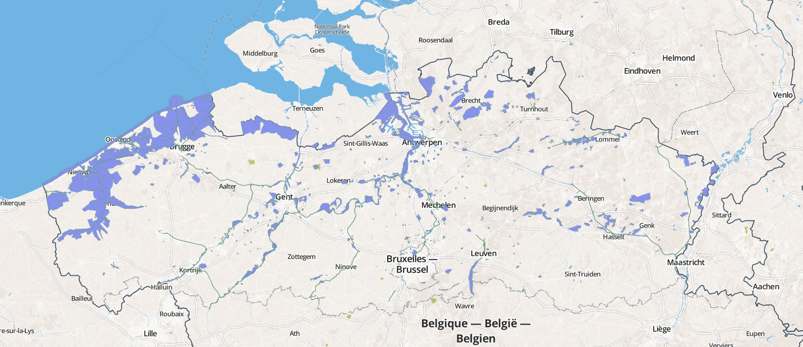

# Watervogels - Wintering waterbirds in Flanders, Belgium

Koen Devos[^1], Filiep T'Jollyn[^1], Peter Desmet[^1], Dimitri Brosens[^1]

[^1]: Research Institute for Nature and Forest (INBO), Kliniekstraat 25, 1070, Brussels, Belgium

**Corresponding author**: Koen Devos (<koen.devos@inbo.be>)

---

**Resource Citation**: Devos K, T'Jollyn F, Brosens D, Desmet P (2012): Watervogels - Wintering waterbirds in Flanders, Belgium. Research Institute for Nature and Forest (INBO). Dataset/Occurrence. <http://doi.org/10.15468/lj0udq>

## Abstract

*Watervogels - Wintering waterbirds in Flanders, Belgium* is a species occurrence dataset published by the Research Institute for Nature and Forest (INBO). The dataset contains more than 75,000 bird counts, covering over 600,000 observations and 35 million individuals for the period 1991-2013. It includes information on 170 species in nearly 1,200 wetland sites. The aim of these bird counts is to gather information on the size, distribution and long term trends of wintering waterbird populations in Flanders. These data are also used to assess the importance of individual sites for waterbirds, using quantitative criteria. Furthermore, the waterbird counts contribute to international monitoring programs, such as the International Waterbird Census (coordinated by Wetlands International) and fulfil some of the objectives of the European Bird Directive, the Ramsar Convention, and the Agreement on the Conservation of African-Eurasian Migratory Waterbirds (AEWA). The data are released in bulk as open data. See the dataset metadata or the publication for contact information, scope and methodology. Issues with the data or dataset can be reported at <https://github.com/LifeWatchINBO/data-publication/tree/master/datasets/watervogels-occurrences>

## Keywords

waterbirds, birds, monitoring, wetlands, population trends, distribution, Lifewatch, open data, Occurrence, Observation

## Data published through

<http://doi.org/10.15468/lj0udq>

## Rationale

Counting waterbirds has a long tradition in Flanders, going back to the 1960s. The aim of this long-running monitoring scheme is to gather reliable information on the numbers, trends, and distribution of these species during their winter and migration period. Through this project, required data become available for international treaties and conventions such as the European Union (EU) [Birds](http://ec.europa.eu/environment/nature/legislation/birdsdirective/index_en.htm) and [Habitats](http://ec.europa.eu/environment/nature/legislation/habitatsdirective/index_en.htm) Directives, the [Ramsar Convention on Wetlands](http://www.ramsar.org/), and the Agreement on the Conservation of African-Eurasian Migratory Waterbirds ([AEWA](http://www.unep-aewa.org/)). These results are also used for informed decision-making by conservation bodies, planners and developers, and contribute to the sustainable use and management of wetlands and their dependent waterbirds.

## Taxonomic coverage

The term waterbirds is used as defined in the AEWA and thus does not only include species which belong to the order *Anseriformes*, but all species which are ecologically dependent on wetlands for at least part of their annual cycle. The dataset includes 170 waterbird species (of which 123 are listed by the AEWA) belonging to the following species groups: divers, grebes, cormorants, herons, storks, spoonbills, swans, geese, ducks, coots, rails, cranes, waders, gulls, and terns. Non-native species which have been introduced or escaped are also included. The top 5 of most occurring species, collectively representing one third of the dataset, is *Anas platyrhynchos*, *Fulica atra*, *Gallinula chloropus*, *Ardea cinerea*, and *Phalacrocorax carbo*.

For all 182 taxa, the Dutch vernacular name is indicated in `vernacularName`. To allow interoperability with other databases, the Euring code is added in `taxonID` for all taxa, except for *Anas flavirostris*, *Anas versicolor*, *Branta sandvicensis*, and *Chloephaga melanoptera* which are not listed by Euring.

### Taxonomic ranks

**Kingdom**: *Animalia* (animals)

**Phylum**: Chordata

**Class**: *Aves* (birds)

**Families**: *Alcidae* (auks), *Anatidae* (ducks, geese & swans), *Ardeidae* (herons), *Charadriidae* (plovers, dotterels & lapwings), *Ciconiidae* (storks), *Gaviidae* (divers), *Gruidae* (cranes), *Haematopodidae* (oystercatchers), *Laridae* (gulls), *Pelecanidae* (pelicans), *Phalacrocoracidae* (cormorants), *Phoenicopteridae* (flamingos), *Podicipedidae* (grebes), *Rallidae* (rails), *Recurvirostridae* (avocets & stilts), *Scolopacidae* (sandpipers), *Stercorariidae* (skuas), *Threskiornithidae* (ibises & spoonbills)

## Geographic coverage

The birds were counted at 1,189 predefined locations (`waterVogelTelgebieden`, figure 1), covering the wetlands and coast of Flanders, Belgium. No birds were counted at sea. These locations are visited regularly during the wintering and migration season (mid-monthly, from October to March). For each occurrence, the code for the `waterVogelTelgebied` is indicated in `localityID`. The polygon shape for most of these localities can be found at <http://git.io/vvDVL>. The geographic coordinates for the occurrences represent the centroid of the locality (see <http://git.io/vvDVR> for the procedure).

*Figure 1: Map of the `waterVogelTelgebieden` in Flanders in which the waterbirds are counted. This geospatial dataset is available in [this repository](http://git.io/vvDVL).*

### Bounding coordinates

50.68° to 51.51° latitude, 2.54° to 5.92° longitude

## Temporal coverage

1991-10-13 to 2013-03-31

## Dataset

### Dataset description

The Darwin Core terms (<http://rs.tdwg.org/dwc/terms/>) in the dataset are: `occurrenceID`, `type`, `language`, `license`, `rightsHolder`, `accessRights`, `datasetID`, `institutionCode`, `datasetName`, `ownerInstitutionCode`, `basisOfRecord`, `recordedBy`, `individualCount`, `eventID`, `samplingProtocol`, `samplingEffort`, `eventDate`, `eventRemarks`, `locationID`, `continent`, `countryCode`, `stateProvince`, `municipality`, `verbatimLocality`, `decimalLatitude`, `decimalLongitude`, `geodeticDatum`, `georeferencedBy`, `georeferencedDate`, `georeferenceProtocol`, `georeferenceSources`, `georeferenceVerificationStatus`, `georeferenceRemarks`, `identifiedBy`, `taxonID`, `scientificName`, `kingdom`, `phylum`, `class`, `taxonRank`, `scientificNameAuthorship`, `vernacularName`, and `nomenclaturalCode`.

* **Object name**: Watervogels - Wintering waterbirds in Flanders, Belgium
* **Character encoding**: UTF-8
* **Format name**: Darwin Core Archive format
* **Format version**: 1.0
* **Distribution**: <http://dataset.inbo.be/watervogels-occurrences>
* **Publication date of data**: `2014-11-27`
* **Language**: English
* **Licenses of use**: <http://creativecommons.org/publicdomain/zero/1.0/>
* **Metadata language**: English
* **Date of metadata creation**: `2014-11-27`
* **Hierarchy level**: Dataset

### Additional information

The following information is not included in this dataset and available upon request: roost site counts, counts from historical (inactive) locations.

## Usage norms

To allow anyone to use this dataset, we have released the data to the public domain under a Creative Commons Zero waiver (<http://creativecommons.org/publicdomain/zero/1.0/>). We would appreciate it however if you read and follow these norms for data use (<https://github.com/LifeWatchINBO/norms-for-data-use>) and provide a link to the original dataset (<http://doi.org/10.15468/lj0udq>) whenever possible. We are always interested to know how you have used or visualized the data, or to provide more information, so please contact us via the contact information provided in the metadata, <opendata@inbo.be> or <https://twitter.com/LifeWatchINBO>.

## Methodology

### Study extent description

The bird counts are organized as a regional network "Waterbird counts Flanders" coordinated by the Research Institute for Nature and Forest (INBO). The network divides Flanders, Belgium into 24 regions, each of them with a local coordinator. The fieldwork is mainly done by skilled volunteer birdwatchers, often working together within local bird clubs. The NGO Natuurpunt (<http://natuurpunt.be>) supports the majority of these bird clubs and volunteers, and thereby delivers an important contribution to the waterbird project. A number of large and important wetland areas are counted by INBO staff (especially in the Scheldt estuary and along the Yser river).

To allow reliable comparisons between years and areas, the counts are aimed for maximum standardization. Every winter, birds are counted in six monthly censuses from October to March, on the weekend the closest to the 15th of the month. Counts use the same methodology and are made at 1,000+ predefined locations (see *Geographic coverage*), covering all kind of wetland habitats in Flanders, such as lakes, ponds, reservoirs, and rivers. Also agricultural areas, often holding large numbers of waterbirds (such as wintering geese), are included. Although the project aims for a (nearly) complete coverage of all areas hosting substantial numbers of waterbirds, this is hard to achieve and the number of counted sites varies between months and years.
 
During counts, numbers of all waterbird species are recorded. This includes divers, grebes, cormorants, herons and allies, swans, geese, ducks, coots and rails. Waders and gulls (optional) have been added on the species list in 1999. Counts of coastal waders are however available since 1992.

Through the site <http://www.watervogels.inbo.be>, volunteers can enter their count and additional data directly into a central database. This database is managed by the INBO and is the source for this dataset.

### Sampling description

The counts are done at predefined locations, called `waterVogelTelgebied`. The name of each `waterVogelTelgebied` is indicated in `verbatimLocality`, while its ID is indicated in `localityID`. The polygon shape for most of these localities can be found at <http://git.io/vvDVL>. The geographic coordinates for the occurrences represent the centroid of the locality (see <http://git.io/vvDVR> for the procedure).

Within the borders of these areas, present waterbird species are counted as completely as possible. Clearly visible areas are often counted from one point with a telescope. Large and less visible areas are usually traversed on foot, by bicycle or by car. A special case are the monthly counts on the Zeeschelde which are performed from boats by INBO staff. The count method (e.g. `survey on land`) is indicated in `samplingProtocol`, while the achieved effort (e.g. `all waterbirds except geese counted`) is indicated in `samplingEffort`.

To reduce the likelihood of birds being double counted or missed, the counts are synchronized as much as possible. Counts are organized on the weekend the closest to the 15th of the month. In large areas with a high probability of local movements, observers are asked to pay special attention to count more or less simultaneously, preferably with multiple observers. Birds are counted during daytime, while specific high tide counts are organized for typical coastal waders (hiding on high tide gather places). The Zeeschelde on the contrary, is mainly counted at low tide due to better visibility of the birds. For some species that are dispersed widely during the day, simultaneous counts on the roost sites are a better alternative for gathering information on their population size. Each winter, supplementary counts are organized for Great Cormorant (since 2003), gulls and Eurasian Curlew. These roost counts are however not included in this database.

Keep in mind that covering of the sites differs between months and years. Calculations of trends and population sizes therefore have to deal with missing values.

### Quality control description

All records are validated.

### Method step description

These are the steps for entering data into the centralized database:

1. Indicate date, start time and end time (all expressed in `eventDate`).
2. Indicate observer (`recordedBy`).
3. Indicate specific count area (`verbatimLocality`). The area has a unique ID (`locationID`) and linked higher geography (`continent`, `countryCode`, `stateProvince`, and `municipality`). Together with the time information, this constitutes a count, which has a unique ID as well (`eventID`).
4. Indicate count method (`samplingProtocol`) and achieved effort (`samplingEffort`).
5. Indicate the count conditions, such as `samplingConditions`, `samplingCoverage`, `snow`, `ice`, and `waterLevel` (all expressed as json in `eventRemarks`).
6. For each observed waterbird species (`scientificName`), indicate the estimated number of birds (`individualCount`).

For publication, the data is further processed:

1. Each record gets a GUID, based on the ID assigned by the database (`occurrenceID`).
2. The `locationID` is cross referenced with the geospatial information for the localities (<http://git.io/vvDVL>).
3. Geographic coordinates are calculated based on the centroid of the locality using this methodology: <http://git.io/vvDVR>. The resulting information is expressed in `decimalLatitude`, `decimalLongitude`, `geodeticDatum`, `georeferencedBy`, `georeferencedDate`, `georeferenceProtocol`, `georeferenceSources`, `georeferenceVerificationStatus`, and 
`georeferenceRemarks`.
4. Taxonomy information is added based on the scientific name and expressed in `kingdom`, `phylum`, `class`, `taxonRank`, `nomenclaturalCode`, and `scientificNameAuthorship`, as well as an Euring code code (`taxonID`) and Dutch vernacular name `vernacularName`.
5. Identification information is added based on the event information: `identifiedBy` = the observer, `dateIdentified` = `eventDate` without time information.
5. Dataset metadata information is added (`type`, `basisOfRecord`, `language`, `datasetID`, `datasetName`, `institutionCode`, `ownerInstitutionCode`) as well the rights holder (`rightsHolder`), the license (`rights`) and data use norms (`accessRights`).

## Project data

### Project title

Waterbird counts Flanders

### Funding

This monitoring project receives funding from the Flemish Government.

## Acknowledgements

## References

Agreement on the Conservation of African-Eurasian Migratory Waterbirds (AEWA) <http://www.unep-aewa.org/>

Birds Directive <http://ec.europa.eu/environment/nature/legislation/birdsdirective/index_en.htm>

Euring exchange-code 2000, species <http://blx1.bto.org/euringcodes/species.jsp>

Habitats Directive <http://ec.europa.eu/environment/nature/legislation/habitatsdirective/index_en.htm>

Ramsar Convention on Wetlands <http://www.ramsar.org/>
